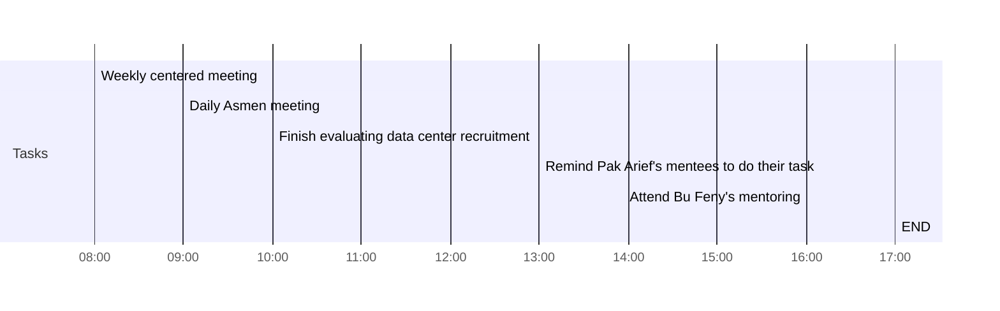

## Day Planner

[[2021-08-25]]
- [x] 08:00 Weekly centered meeting
- [x] 09:00 Daily Asmen meeting
- [x] 10:00 Finish evaluating data center recruitment
- [x] 13:00 Remind Pak Arief's mentees to do their task
- [x] 16:00 Attend Bu Feny's mentoring
- [ ] 17:00 END
